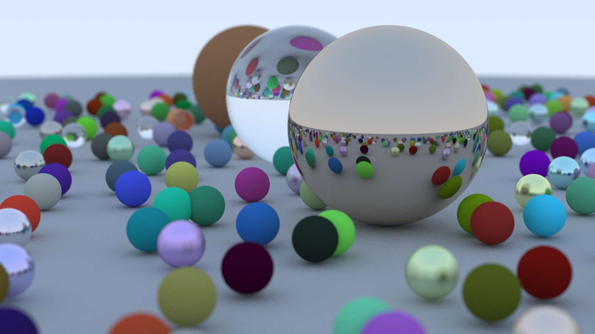

# Torch Tracer

An implementation of a raytracer in Python. It is a version of the raytracing algorithm highly
optimized through parallelization with pyTorch and GPU acceleration. It allows for realistic
rendering of 3D scenes with shadows, reflections, and refractions, showcasing a variety of 3D shapes
and materials. A perfect example of the power of parallel computing.

To read my blog post on the project, click [here](https://mvazquez.ai/blog/output/2024-10-27-torch-tracing-01/content.html).

Based on the book [&#34;Ray Tracing in One Weekend&#34; by Peter Shirley](https://raytracing.github.io/books/RayTracingInOneWeekend.html) where a basic raytracer is implemented using C++ in a sequential manner, but I have implemented it in Python with PyTorch and parallelized the raytracing.



This is the same image as in the book (modulo random sphere placement) rendered using the Torch Tracer. The scene includes various 3D shapes, materials, and lighting effects to demonstrate the capabilities of the raytracer.

## Features

- 🚀 GPU acceleration with PyTorch

  - Batched ray processing for efficient GPU utilization
  - Parallel computation of ray intersections and color calculations
  - Configurable batch size to manage memory usage
- 🎨 Advanced Ray Tracing Capabilities

  - Multiple ray bounces with configurable maximum depth
  - Anti-aliasing through multiple samples per pixel
  - Depth of field and defocus blur effects
  - Realistic shadows and reflections
- ✨ Material System

  - Lambertian (diffuse) surfaces with matte finish
  - Metal surfaces with configurable reflectivity and fuzz
  - Dielectric (glass) materials with refraction
  - Support for multiple materials in a single scene
- 📷 Camera System

  - Configurable field of view and aspect ratio
  - Adjustable camera position and orientation
  - Focus distance and defocus angle controls
  - Support for different image resolutions
- 🛡️ Type Safety

  - Static type checking with jaxtyping
  - Runtime type validation with typeguard
  - Array shape and dtype validation

## Comparison with the Book

The book implements the raytracer in C++. For every pixel in the view plane, the book computes `samples_per_pixel` rays through the pixel and then traces the ray through the scene to compute the color of the pixel. This is done sequentially for each pixel and sample. 

The Torch Tracer implements the same algorithm, but uses parallelization with PyTorch to compute the rays in parallel for every pixel and sample in the view plane. This allows for a significant speedup in rendering time.

This means that for an image with 1920x1080 pixels and 120 samples per pixel, the book computes 1920x1080x120=248,832,000 rays to render the image. Every ray may bounce multiple times, for a maximum of `max_depth` bounces. This means that the book computes 248,832,000 x 50 = 12,441,600,000 rays to render the image.

The Torch Tracer computes the same number of rays, but does it in parallel for every pixel and sample. This means that, if enough GPU memory is available, the Torch Tracer can render the image in just `max_depth` (50 in this case) passes in parallel.

In practice, I have evaluated by generating the same scene as in the book's repository, and the Torch Tracer takes ~170 seconds on my GPU (a laptop NVIDIA GeForce RTX 4050 with 8GB of memory), compared to ~645 seconds for the book's C++ implementation. That's a speedup of ~3.79x. The main limiting factor for the Torch Tracer is the GPU memory, for which I have implemented a sequential batching system, but potentially every ray tracing bounce could be done in parallel.

## Usage

The raytracer supports various materials and camera configurations for rendering 3D scenes.

### Materials

- **Lambertian**: Diffuse material with matte finish
- **Metal**: Reflective material with configurable fuzz for glossiness
- **Dielectric**: Glass-like material with refraction (configurable index)

### Camera Configuration

```python
camera = Camera(
image_width=1920, # Width of output image
samples_per_pixel=120, # Anti-aliasing samples
aspect_ratio=16.0/9.0, # Image aspect ratio
max_depth=50, # Maximum ray bounce depth
vfov=20, # Vertical field of view in degrees
look_from=[13, 2, 3], # Camera position
look_at=[0, 0, 0], # Point camera looks at
vup=[0, 1, 0], # Camera up vector
defocus_angle=0.6, # Depth of field blur amount
focus_dist=10.0, # Distance to focus plane
batch_size=50_000 # Ray batch size for GPU processing
)
```

### World Configuration

To render a scene, create a world with spheres and materials, then use the camera to render:

```python
world = SphereList(
centers=sphere_centers,
radii=sphere_radii,
material_types=material_types,
albedos=albedos,
fuzzes=fuzzes,
refractive_indices=refractive_indices
)
```

### Rendering

```python
image = camera.render(world)
image.save("render.png")
```

## Setup

### Prerequisites

1. Install PyTorch with CUDA support:

   - Visit [PyTorch&#39;s official website](https://pytorch.org/get-started/locally/) to install the correct PyTorch and CUDA versions for your system
   - GPU acceleration is highly recommended as CPU rendering is significantly slower
2. Install dependencies:

```bash
pip install -r requirements.txt
```

### Device Configuration

The renderer can use either GPU or CPU, configured in `config.py`:

```python
device = t.device("cuda" if t.cuda.is_available() else "cpu")
```

**Note:**

- CPU rendering can be extremely slow for high-resolution images
- GPU rendering might encounter memory issues with high image resolutions or large numbers of samples per pixel (adjust `samples_per_pixel` in camera settings accordingly)

### Type Checking

This project uses static type checking with:

- `jaxtyping`: For array shape and dtype validation
- `typeguard`: For runtime type checking

These typing guards help ensure correct tensor shapes and types throughout the raytracing process.
